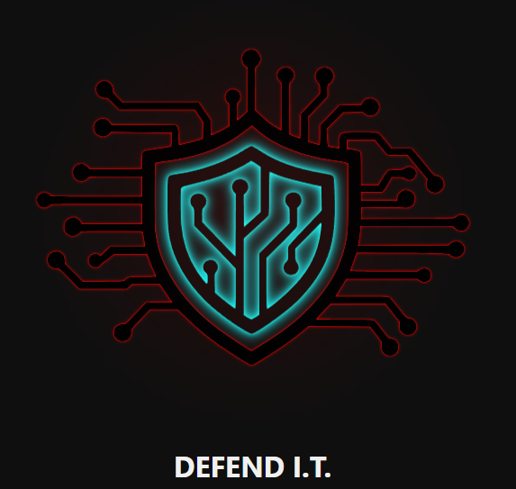

# DEFEND I.T.

## Table of Contents

- [DEFEND I.T.](#defend-it)
  - [Table of Contents](#table-of-contents)
  - [Screenshot](#screenshot)
  - [Cybersecurity That Fights Back](#cybersecurity-that-fights-back)
  - [About the Founder](#about-the-founder)
  - [Services](#services)
    - [General](#general)
    - [Advanced Cyber Capabilities](#advanced-cyber-capabilities)
    - [Consulting \& Support](#consulting--support)
  - [Contact](#contact)

## Screenshot

## Cybersecurity That Fights Back

**DEFEND I.T.** is a cybersecurity-focused initiative built to help individuals, homeowners, and small businesses stay protected in an increasingly hostile digital landscape. This is a temporary landing page representing a pending Florida-based LLC.

---

## About the Founder

I'm a cybersecurity engineering senior and full stack web developer with deep skills in:

- Offensive and defensive security
- Digital forensics and malware analysis
- Software development (Python, C, JavaScript)
- Network operations, assessment, and secure design

This site is an early representation of the services that will be offered through DEFEND I.T.

---

## Services

### General

- Cybersecurity
- Networking
- Web & Software
- Data Recovery
- Forensics
- Virus & Malware Removal
- Computer Repair
- Site Surveys

### Advanced Cyber Capabilities

- Threat Analysis
- Incident Response
- Vulnerability Assessments
- Security Audits
- Penetration Testing
- Reverse Engineering
- Malware Analysis
- Secure Code Review

### Consulting & Support

- IT Consulting
- Wi-Fi Security Assessments
- Firewall Configuration
- VPN Setup
- Email Security & Anti-Phishing
- Cloud Security Configurations
- Security Awareness Training
- Policy Development & Compliance Guidance

---

## Contact

If you have questions, please email: [info@wedefendit.com](mailto:info@wedefendit.com)
